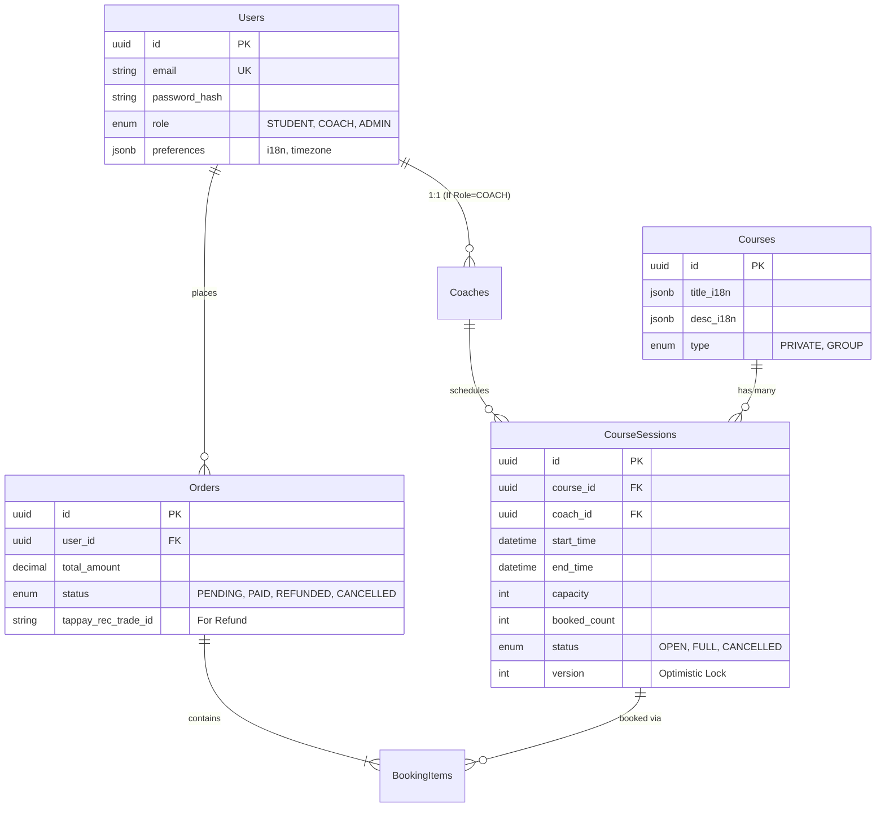
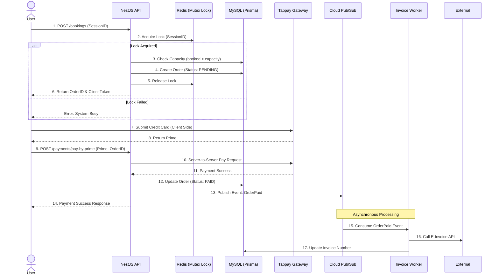

# Technical Plan - 專家級架構實作計畫 (Expert Architecture Plan)

## 1. 系統總體架構 (High-Level Architecture)
本系統採用 **Clean Architecture (整潔架構)** 結合 **Event-Driven Architecture (事件驅動架構)**，確保預約引擎的高併發處理能力與金流/發票模組的解耦。

### 1.1 核心分層 (Clean Architecture Layers)
*   **Presentation Layer (API/GraphQL):** 處理 HTTP 請求、路由驗證 (NestJS Controllers, Guards, Interceptors)。
*   **Application Layer (Use Cases):** 定義業務流程，如 `CreateBookingUseCase`, `ProcessPaymentWebhookUseCase`。
*   **Domain Layer (Entities & Aggregates):** 封裝核心業務邏輯與狀態機，如 `Order` 實體狀態轉換、`Booking` 餘位檢核邏輯。不依賴任何外部框架。
*   **Infrastructure Layer:** 實作資料庫存取 (Prisma Repositories)、外部 API 串接 (Tappay SDK, 電子發票 API)、Message Queue/Redis 操作。

### 1.2 基礎設施拓撲 (GCP Infrastructure Topology)
```mermaid
graph TD
    Client[Mobile/Web Client] --> CDN[Cloud CDN & Load Balancer]
    CDN --> FE[React Static Assets (GCS)]
    CDN --> API_GW[NestJS API Cluster (GCE/Cloud Run)]
    
    API_GW --> DB[(Cloud SQL - MySQL 8.0 Primary)]
    DB -.-> DB_Replica[(Cloud SQL - Replica)]
    
    API_GW --> Cache[(Cloud Memorystore - Redis)]
    
    API_GW --> PubSub[Cloud Pub/Sub (Event Bus)]
    PubSub --> Worker_Invoice[Invoice Worker]
    PubSub --> Worker_Notification[Email/SMS Worker]
    
    API_GW --> Tappay[Tappay Payment Gateway]
```

## 2. 核心領域模型與 ERD (Domain Model & Entity Relationship)



## 3. 預約與金流序列圖 (Booking & Payment Sequence)
採用分散式鎖 (Distributed Lock) 與樂觀鎖 (Optimistic Locking) 處理高併發預約，並透過事件驅動處理發票。



## 4. 痛點解決：全自動多語系快取策略 (i18n Caching Strategy)
為解決多語系校正耗時且需重啟的問題，我們設計了 **Multi-Layer i18n Cache (多層級多語系快取)**。

1.  **L1 Cache (Frontend Memory):** React 使用 `SWR` 或 `React Query` 暫存 i18n API 回應。
2.  **L2 Cache (Redis):** NestJS 將完整的 i18n Dictionary 存入 Redis，TTL 設定為 24 小時。
3.  **L3 Source (Database):** 核心資料存於 MySQL JSONB 欄位。

**動態刷新機制 (Cache Invalidation):**
當管理員在後台更新某個單字時：
1.  NestJS 更新 MySQL。
2.  NestJS 執行 `Redis.DEL('i18n:zh_TW')` 清除 L2 Cache。
3.  NestJS 透過 Webhook 或 SSE (Server-Sent Events) 通知前端清除 L1 Cache 並重新 Fetch。
4.  **結果：管理員按下儲存後，全球用戶在 1 秒內無縫看到最新翻譯，達成 Zero-Downtime Update。**

## 5. 測試與驗證策略 (Testing Strategy)
*   **Domain Unit Tests (Jest):** 針對 `Order` 狀態機 (State Machine) 與 `BookingCapacity` 計算進行 100% 覆蓋測試。
*   **Integration Tests (Supertest + Testcontainers):** 啟動獨立的 MySQL 與 Redis Container，驗證 API 端點與資料庫鎖定機制。
*   **E2E Tests (Playwright):** 模擬 User 在手機端瀏覽器中的完整預約與 Tappay 沙盒刷卡流程。
