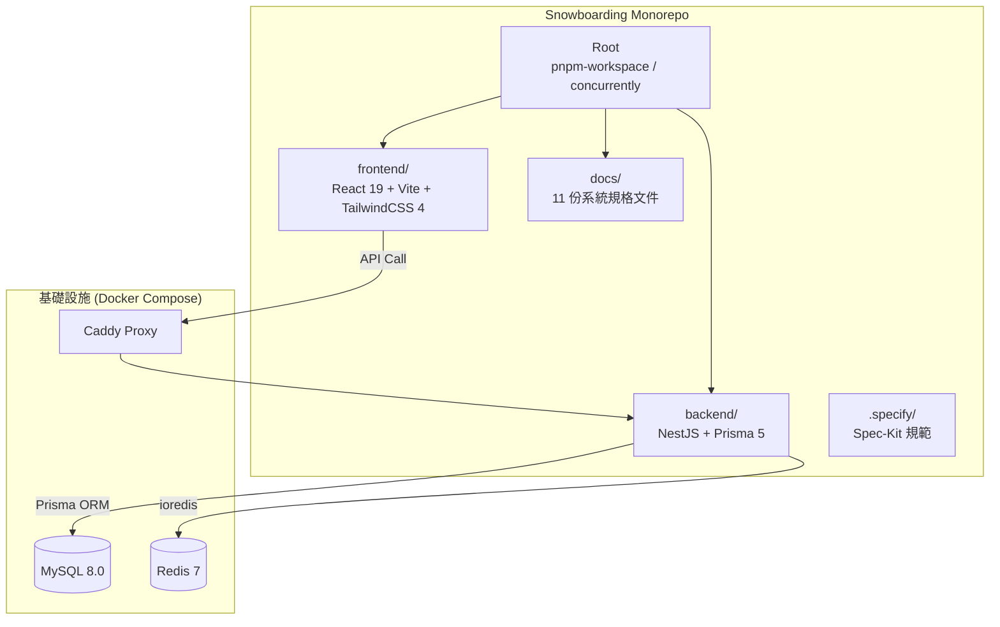

# 🏔️ 滑雪課程預約系統 V2 — 整體架構解析 (V2.0)

---

## 1. 頂層架構總覽 (Top-level Architecture)

本專案採用 **pnpm Monorepo** 管理，前後端共存於同一存儲庫，透過 `pnpm-workspace.yaml` 統一管理依賴。

---

## 2. 技術棧定義 (Finalized Tech Stack)

| 層級         | 技術                     | 版本 | 用途                     |
| :----------- | :----------------------- | :--- | :----------------------- |
| **前端框架** | React + TypeScript       | 19.0 | SPA 頁面渲染與互動       |
| **建構工具** | Vite                     | 5+   | 極速開發體驗與 HMR       |
| **樣式系統** | Tailwind CSS             | 4.0  | 原子化 CSS 與主題控制    |
| **狀態管理** | Zustand / TanStack Query | v5   | 全域狀態與伺服器快取     |
| **後端框架** | NestJS                   | 11.0 | 企業級 Node.js 框架      |
| **ORM**      | Prisma                   | 5.x  | 型別安全的資料庫操作     |
| **資料庫**   | MySQL                    | 8.0  | 核心業務資料儲存         |
| **快取/鎖**  | Redis (ioredis)          | 7.x  | 分散式鎖與 i18n 快速讀取 |
| **認證**     | Firebase Auth            | —    | 統一身分驗證入口         |
| **反向代理** | Caddy                    | 2.x  | 自動 SSL 與 API 路由轉發 |

---

## 3. 後端核心模組 (Backend Modules)

後端遵循 **Clean Architecture** 原則，每個模組具備清晰的邊界。

- **AuthModule:** 整合 Firebase Admin SDK，處理本地 User 同步與 LINE Custom Token。
- **BookingModule:** 核心業務邏輯，實作 **Redis 分散式鎖** 與 **Prisma 樂觀鎖** 以確保不超賣。
- **PaymentModule:** 串接 TapPay API，具備 Webhook **HMAC 簽名驗證**。
- **InvoiceModule:** 監聽 `order.paid` 事件，透過 **EventEmitter2** 異步呼叫 ECPay API 開立發票。
- **I18nModule:** 處理 JSONB 動態翻譯，整合 Redis 二層快取。

---

## 4. 前端關鍵頁面 (Frontend Pages)

- **Calendar.tsx:** 核心預約介面，整合 `TappayPayment` 元件與實時時段過濾。
- **Dashboard.tsx:** 採用 Framer Motion 實作的動態數據看板，包含滑雪等級進度圓環。
- **Auth.tsx:** 整合 Google/LINE 社群登入，實作「靜默同步」流程。

---

## 5. 部署與 DevOps (Infrastructure)

- **本地開發：** 使用 `docker-compose.yml` 啟動 MySQL 與 Redis 基礎服務。
- **生產環境：** 部署於 GCP (Google Compute Engine)，搭配 Cloud SQL 與 GCS 檔案儲存。
- **SSL 憑證：** 由 Caddy 自動管理 Let's Encrypt 憑證。
- **日誌：** 整合 Winston 與 Google Cloud Logging。
