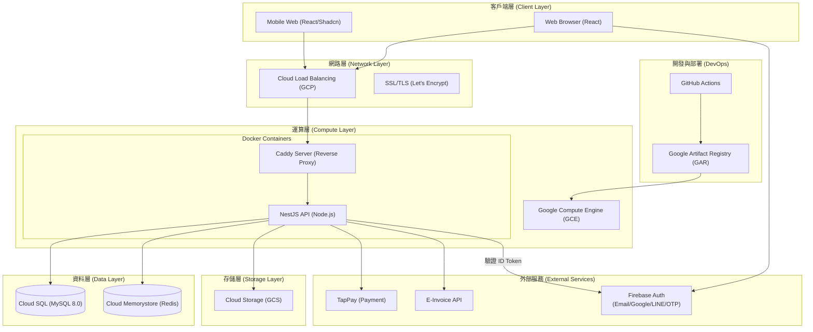

# Overall Architecture - 系統整體架構圖

## 1. 系統架構圖 (Mermaid Diagram)

---

## 2. 架構組件說明 (Component Details)

### 2.1 客戶端層 (Client Layer)

- **技術棧：** React 18, TypeScript, Tailwind CSS。
- **特性：** 響應式設計，針對手機端進行 UI/UX 優化，提供流暢的預約體驗。

### 2.2 運算層 (Compute Layer)

- **基礎設施：** 部署於 Google Compute Engine (GCE) 上的 Docker 容器。
- **核心 API：** 使用 NestJS 框架，具備強型別、依賴注入與模組化架構。
- **反向代理：** 由 Caddy 負責 HTTPS 自動憑證與後端 API 路由分發。

### 2.3 資料與存儲層 (Data & Storage)

- **關聯式資料庫：** Cloud SQL (MySQL 8.0)，儲存會員、課程、訂單等核心業務資料。
- **快取與鎖定：** Cloud Memorystore (Redis)，用於 Session 管理、高併發名額鎖定（Distributed Lock）與翻譯字典快取。
- **物件存儲：** Cloud Storage (GCS)，存放教練證照圖片、課程縮圖及電子發票 PDF。

### 2.4 外部整合 (External Integrations)

- **金流：** 整合 TapPay Pay-by-Prime，確保平台不接觸信用卡明文，符合 PCI-DSS 規範。
- **發票：** 付款成功後透過 Event-Driven 架構自動呼叫電子發票 API。
- **認證：** 整合 Firebase Authentication 提供 Email、Google、LINE、OTP 統一登入入口，後端使用 `firebase-admin` 驗證 ID Token。

### 2.5 CI/CD 流程

- 自動化建置 Docker Image 並推送到 Google Artifact Registry (GAR)。
- 透過 GitHub Actions 觸發 GCE 執行個體更新，實現持續整合與部署。
