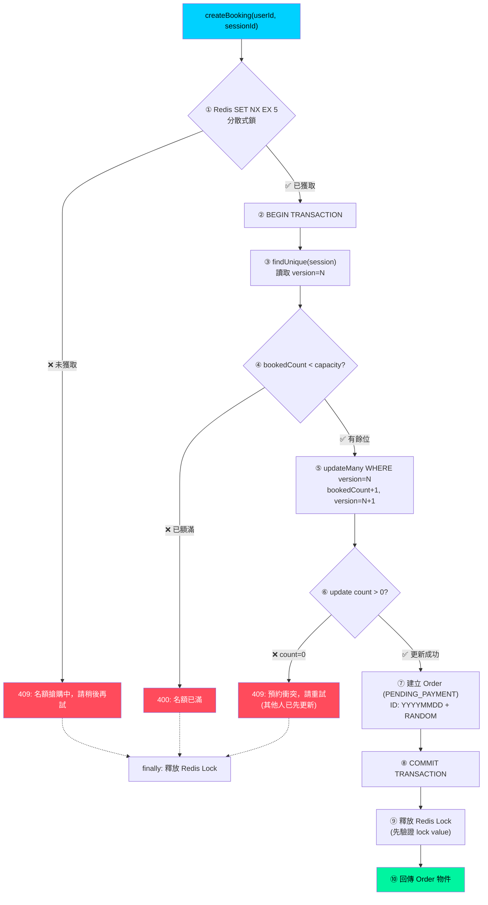
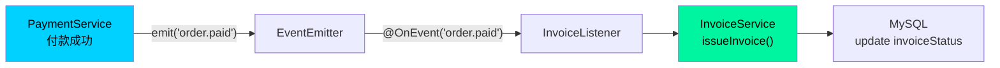
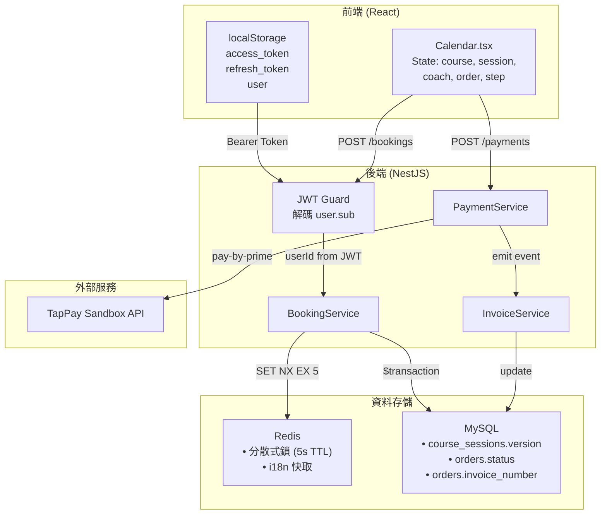

# 🎿 預約流程全鏈路追蹤 (End-to-End Booking Flow)

> 從使用者點擊「立即預約」到「發票開立」的完整資料流追蹤，附上每一步的代碼定位。

---

## 全局時序圖

```mermaid
sequenceDiagram
    autonumber
    participant User as 👤 使用者
    participant App as App.tsx
    participant Home as Home.tsx
    participant Auth as Auth.tsx
    participant Cal as Calendar.tsx
    participant API as api.ts
    participant BC as BookingController
    participant BS as BookingService
    participant Redis as Redis
    participant DB as MySQL (Prisma)
    participant PC as PaymentController
    participant PS as PaymentService
    participant TapPay as TapPay API
    participant EVT as EventEmitter
    participant IL as InvoiceListener
    participant IS as InvoiceService

    rect rgb(40, 40, 60)
        Note over User, Home: Phase 0: 導航入口
        User->>Home: 點擊「立即預約」按鈕
        Home->>App: onNavigate()
        App->>App: navigateToBooking()
        alt 未登入
            App->>Auth: setCurrentPage('auth')
            User->>Auth: 輸入 email + password
            Auth->>API: api.login(email, pass)
            API->>BC: POST /api/v1/auth/login
            BC-->>API: { access_token, refresh_token, user }
            API-->>Auth: 儲存至 localStorage
            Auth->>App: onSuccess(user)
            App->>Cal: setCurrentPage('calendar')
        else 已登入
            App->>Cal: setCurrentPage('calendar')
        end
    end

    rect rgb(40, 60, 40)
        Note over User, DB: Phase 1: 選擇課程
        Cal->>API: fetchCourses()
        API->>BC: GET /api/v1/courses
        BC->>DB: prisma.course.findMany()
        DB-->>Cal: Course[] (含多語系 JSON title)
        User->>Cal: 點選課程卡片
        Cal->>Cal: setSelectedCourse() → setCurrentStep(2)
    end

    rect rgb(40, 50, 70)
        Note over User, DB: Phase 2: 選擇日期時段
        Cal->>API: fetchSessions(courseId)
        API->>BC: GET /api/v1/courses/sessions?courseId=xxx
        BC->>DB: prisma.courseSession.findMany()
        DB-->>Cal: Session[] (含 capacity, bookedCount)
        User->>Cal: 選擇日期 → 選擇時段
        Cal->>Cal: setSelectedSession() → 點「下一步」→ setCurrentStep(3)
    end

    rect rgb(60, 40, 60)
        Note over User, Cal: Phase 3: 選擇教練 (⚠️ 目前硬編碼)
        User->>Cal: 選擇教練卡片
        Cal->>Cal: setSelectedCoach()
        User->>Cal: 點擊「確認預約並前往結帳」
    end

    rect rgb(80, 40, 40)
        Note over Cal, IS: Phase 4: 預約 + 鎖定 + 付款 + 發票
        Cal->>API: handleBooking()
        API->>BC: POST /api/v1/bookings { sessionId }
        BC->>BS: createBooking(userId, sessionId)
        BS->>Redis: SET lock:session:xxx NX EX 5
        alt 鎖競爭失敗
            Redis-->>BS: null
            BS-->>Cal: 409 ConflictException
        else 鎖獲取成功
            BS->>DB: BEGIN TRANSACTION
            BS->>DB: findUnique(session + course)
            DB-->>BS: session data (version=N)
            BS->>DB: updateMany WHERE version=N → bookedCount+1, version=N+1
            alt 樂觀鎖衝突
                DB-->>BS: count=0
                BS-->>Cal: 409 ConflictException
            else 更新成功
                BS->>DB: create Order (PENDING_PAYMENT) + BookingItem
                DB-->>BS: Order { id: "20260801XXXXX" }
                BS->>DB: COMMIT
            end
            BS->>Redis: DEL lock:session:xxx
        end
        BS-->>Cal: Order 物件

        Note over User, TapPay: Phase 4b: TapPay 付款
        Cal->>Cal: setCurrentOrder(order) → setCurrentStep(4)
        User->>Cal: 輸入信用卡 → 點「確認付款」
        Cal->>Cal: TPDirect.card.getPrime()
        Cal->>API: handlePaymentSuccess(prime)
        API->>PC: POST /api/v1/payments/pay-by-prime { orderId, prime }
        PC->>PS: payByPrime(orderId, prime)
        PS->>DB: findUnique(order + user)
        PS->>TapPay: POST pay-by-prime (prime, amount, cardholder)
        alt 付款成功 (status=0)
            TapPay-->>PS: { status: 0, rec_trade_id }
            PS->>DB: update order → PAID + rec_trade_id
            PS->>EVT: emit('order.paid', { orderId })
            EVT->>IL: handleOrderPaidEvent({ orderId })
            IL->>IS: issueInvoice(orderId)
            IS->>DB: findUnique(order + items)
            IS->>DB: update order → invoiceStatus: ISSUED, invoiceNumber
            PS-->>Cal: { status: 'SUCCESS' }
            Cal->>User: alert('付款成功！發票已開立。')
        else 付款失敗
            TapPay-->>PS: { status: ≠0, msg }
            PS-->>Cal: 400 BadRequestException
            Cal->>User: alert('付款失敗')
        end
    end
```



---

## 逐步代碼追蹤

### Phase 0: 導航入口 — 認證閘道

使用者從首頁進入預約流程時，`App.tsx` 中的 `navigateToBooking()` 扮演認證閘道角色：

````carousel
```typescript
// App.tsx L35-41 — 認證閘道
const navigateToBooking = () => {
  if (!user) {
    setCurrentPage('auth');   // 未登入 → 導向登入頁
  } else {
    setCurrentPage('calendar'); // 已登入 → 直接進日曆
  }
};
````

<!-- slide -->

```typescript
// App.tsx L12-21 — 認證狀態初始化 (從 localStorage 還原)
const [user, setUser] = useState<User | null>(() => {
  const savedUser = localStorage.getItem('user');
  try {
    return savedUser ? JSON.parse(savedUser) : null;
  } catch {
    return null;
  }
});
```

<!-- slide -->

```typescript
// App.tsx L23-27 — 登入成功回調
const handleAuthSuccess = (userData: User) => {
  setUser(userData);
  localStorage.setItem('user', JSON.stringify(userData));
  setCurrentPage('dashboard'); // ⚠️ 注意: 登入後去 dashboard，非 calendar
};
```

`````

> [!WARNING]
> **設計問題**: 若使用者是從「立即預約」觸發登入，登入成功後會被導向 **Dashboard** 而非 **Calendar**，打斷預約流程。`handleAuthSuccess` 未區分登入來源。

**觸發元素位置**:
- CTA 按鈕: [Home.tsx L46-50](file:///c:/Users/benit/Desktop/Snowboarding/frontend/src/pages/Home.tsx#L46-L50) — `onClick={onNavigate}`
- Navbar 預約按鈕: [Navbar.tsx](file:///c:/Users/benit/Desktop/Snowboarding/frontend/src/components/Navbar.tsx) — `onNavigate` prop

---

### Phase 1: 選擇課程 — `GET /api/v1/courses`

````carousel
```typescript
// Calendar.tsx L19-26 — 前端: 取得課程列表
const fetchCourses = async (): Promise<Course[]> => {
  const data = await api.fetch('/courses');
  return data.map((c: any) => ({
    id: c.id,
    title: c.title,           // JSON: {"zh-TW": "...", "en": "..."}
    price: Number(c.basePrice) // Decimal → Number 轉換
  }));
};
// 自動載入 (L50-52)
useEffect(() => {
  fetchCourses().then(setCourses).catch(console.error);
}, []);
```
<!-- slide -->
```typescript
// course.controller.ts L80-84 — 後端 Controller
@Get()
@ApiOperation({ summary: '取得所有課程列表' })
async findAll() {
  return this.courseService.findAll();
}
```
<!-- slide -->
```typescript
// course.service.ts L25-27 — 後端 Service
async findAll() {
  return this.prisma.course.findMany();
  // ⚠️ 無分頁、無排序、無語系過濾
}
```
`````

**前端渲染邏輯** ([Calendar.tsx L177-191](file:///c:/Users/benit/Desktop/Snowboarding/frontend/src/pages/Calendar.tsx#L177-L191)):

- 根據 `i18n.language` 從 JSON title 中提取對應語言: `course.title[currentLng] || course.title['zh-tw']`
- 價格透過 `getPrice()` 函數依語系做幣值轉換 (JPY → TWD/USD)

> [!NOTE]
> **資料流向**: `Course.title` 在 DB 中是 **JSON** 格式 (e.g. `{"zh-TW": "初階單板體驗", "en": "Beginner Snowboard"}`)，前端直接按 key 取值，實現免 API 呼叫的即時語系切換。

---

### Phase 2: 選擇日期時段 — `GET /api/v1/courses/sessions`

````carousel
```typescript
// Calendar.tsx L28-30 — 前端: 取得課程時段
const fetchSessions = async (courseId: string): Promise<Session[]> => {
  return api.fetch(`/courses/sessions?courseId=${courseId}`);
};
// 當課程被選中時自動觸發 (L54-58)
useEffect(() => {
  if (selectedCourse) {
    fetchSessions(selectedCourse.id).then(setSessions);
  }
}, [selectedCourse]);
```
<!-- slide -->
```typescript
// course.controller.ts L98-116 — 後端 Controller
@Get('sessions')
@ApiQuery({ name: 'coachId', required: false })
@ApiQuery({ name: 'locationId', required: false })
@ApiQuery({ name: 'start', required: false })
@ApiQuery({ name: 'end', required: false })
async findSessions(
  @Query('coachId') coachId?: string,
  @Query('locationId') locationId?: string,
  @Query('start') start?: string,
  @Query('end') end?: string,
) {
  return this.courseService.findSessions({ coachId, locationId, start, end });
}
```
<!-- slide -->
```typescript
// course.service.ts L66-92 — 後端 Service
async findSessions(query) {
  return this.prisma.courseSession.findMany({
    where: {
      coachId: query.coachId,
      locationId: query.locationId,
      startTime: { gte: query.start, lte: query.end },
    },
    include: {
      coach: { include: { user: { select: { email: true } } } },
      course: true,
    },
  });
  // ⚠️ 前端傳 courseId 但後端 WHERE 條件未使用 courseId 做過濾
}
```
````

> [!CAUTION]
> **Bug**: 前端呼叫 `GET /courses/sessions?courseId=xxx`，但後端 `findSessions()` 的 WHERE 條件**沒有 `courseId` 過濾**，回傳所有 Session 而非特定課程的 Session。查看 [course.service.ts L72-79](file:///c:/Users/benit/Desktop/Snowboarding/backend/src/course/course.service.ts#L72-L79)。

---

### Phase 3: 選擇教練 (⚠️ 硬編碼)

```typescript
// Calendar.tsx L114-116 — 教練資料 (Frontend Hardcoded)
const coaches = [
  {
    id: 'c1',
    name: 'Kenji',
    level: 'Level 3 SAJ',
    bio: '專精粉雪與進階刻蝕',
    avatar: 'https://images.unsplash.com/...', // 外部圖片
  },
];
// ⚠️ 無 API 呼叫。教練選擇在 Step 2 → Step 3 自動跳轉時已預設:
// L235: onClick={() => { setSelectedCoach(coaches[0]); setCurrentStep(3); }}
```

> [!WARNING]
> **硬編碼問題**: 教練列表完全 hardcoded，且在進入 Step 3 前就自動選了 `coaches[0]`。實際上 Step 3 的「選擇」只有一個選項。需改為從 API 動態獲取可用教練。

---

### Phase 4a: 建立預約 — `POST /api/v1/bookings`

這是整個流程最關鍵的核心路徑，包含 **Redis 分散式鎖 + DB 樂觀鎖** 雙重並行控制。

````carousel
```typescript
// Calendar.tsx L60-76 — 前端: 發起預約
const handleBooking = async () => {
  if (!selectedSession) return;
  setIsProcessing(true);
  try {
    const order = await api.fetch('/bookings', {
      method: 'POST',
      body: JSON.stringify({ sessionId: selectedSession.id })
    });
    setCurrentOrder(order);  // 暫存訂單
    setCurrentStep(4);       // 進入結帳頁
  } catch (err: any) {
    alert('預約失敗: ' + err.message);
  }
};
```
<!-- slide -->
```typescript
// api.ts L4-15 — HTTP 封裝 (自動附帶 JWT)
async fetch(endpoint, options = {}) {
  const token = localStorage.getItem('access_token');
  const headers = {
    'Content-Type': 'application/json',
    ...options.headers,
    ...(token ? { 'Authorization': `Bearer ${token}` } : {}),
  };
  let response = await fetch(`${API_BASE_URL}${endpoint}`, { ...options, headers });
  // 若 401 → 自動呼叫 /auth/refresh 刷新 Token 並重試 (L18-53)
}
```
<!-- slide -->
```typescript
// booking.controller.ts L25-39 — 後端 Controller
@Post()
@UseGuards(AuthGuard('jwt'))  // JWT 認證守衛
@ApiBearerAuth()
async createBooking(
  @Request() req: RequestWithJwtUser,
  @Body() createBookingDto: CreateBookingDto, // { sessionId: UUID }
) {
  const userId = req.user.sub; // 從 JWT payload 取得 userId
  return this.bookingService.createBooking(userId, createBookingDto.sessionId);
}
```
````

#### BookingService 核心邏輯 — 雙重鎖機制



**完整代碼對照** ([booking.service.ts L21-102](file:///c:/Users/benit/Desktop/Snowboarding/backend/src/booking/booking.service.ts#L21-L102)):

```typescript
async createBooking(userId: string, sessionId: string) {
  // ① 分散式鎖 — 防止大量並行請求同時打到 DB
  const lockKey = `lock:session:${sessionId}`;
  const lockValue = Date.now().toString();
  const acquired = await this.redisClient.set(lockKey, lockValue, 'EX', 5, 'NX');
  if (!acquired) throw new ConflictException('目前名額搶購中，請稍後再試');

  try {
    return await this.prisma.$transaction(async (tx) => {
      // ③ 讀取目前 Session 資料 (含 version)
      const session = await tx.courseSession.findUnique({
        where: { id: sessionId },
        include: { course: true },
      });
      if (!session) throw new NotFoundException('找不到該課程時段');

      // ④ 容量檢查
      if (session.bookedCount >= session.capacity) {
        throw new BadRequestException('名額已滿');
      }

      // ⑤ 樂觀鎖 — WHERE version=N 確保在讀取與更新間無他人修改
      const updateResult = await tx.courseSession.updateMany({
        where: {
          id: sessionId,
          version: session.version,                   // 關鍵: 版本校驗
          bookedCount: { lt: session.capacity },       // 雙重保險
        },
        data: {
          bookedCount: { increment: 1 },
          version: { increment: 1 },
        },
      });

      // ⑥ 若 count=0 代表版本已過期 (他人已修改)
      if (updateResult.count === 0) {
        throw new ConflictException('預約衝突，請重試');
      }

      // ⑦ 建立訂單 + 預約項目 (原子性 within transaction)
      const dateStr = new Date().toISOString().slice(0, 10).replace(/-/g, '');
      const randomStr = Math.random().toString(36).substring(2, 7).toUpperCase();
      const orderId = `${dateStr}${randomStr}`;

      const order = await tx.order.create({
        data: {
          id: orderId,
          userId,
          totalAmount: session.course.basePrice,
          status: OrderStatus.PENDING_PAYMENT,
          items: {
            create: {
              sessionId: sessionId,
              price: session.course.basePrice,
            },
          },
        },
      });

      // ⚠️ TODO: Redis TTL 超時自動釋放 (L91-92)
      return order;
    });
  } finally {
    // ⑨ 安全釋放鎖 (僅刪除自己持有的鎖)
    const currentLockValue = await this.redisClient.get(lockKey);
    if (currentLockValue === lockValue) {
      await this.redisClient.del(lockKey);
    }
  }
}
```

> [!IMPORTANT]
> **雙重鎖設計理由**:
>
> - **Redis 分散式鎖 (Layer 1)**: 在應用層攔截大量並行請求，只讓一個請求進入 DB 交易，防止 DB 連線池被瞬間耗盡。
> - **DB 樂觀鎖 (Layer 2)**: 即使 Redis 鎖在極端情況下失效 (如 Redis 重啟)，DB 層的 `version` 欄位仍能保證資料一致性。

---

### Phase 4b: TapPay 付款 — `POST /api/v1/payments/pay-by-prime`

````carousel
```typescript
// Calendar.tsx L78-97 — 前端: 付款成功回調
const handlePaymentSuccess = async (prime: string) => {
  const result = await api.fetch('/payments/pay-by-prime', {
    method: 'POST',
    body: JSON.stringify({ orderId: currentOrder.id, prime })
  });
  if (result.status === 'SUCCESS') {
    alert('付款成功！發票已開立。');
    onNavigate(); // 回首頁
  }
};
```
<!-- slide -->
```typescript
// TappayPayment.tsx L30-72 — TapPay SDK 初始化 + getPrime
useEffect(() => {
  if (window.TPDirect) {
    window.TPDirect.setupSDK(appId, appKey, 'sandbox');
    window.TPDirect.card.setup({
      fields: {
        number:         { element: '#card-number' },
        expirationDate: { element: '#card-expiration-date' },
        ccv:            { element: '#card-ccv' }
      }
    });
  }
}, []);

const handleGetPrime = () => {
  window.TPDirect.card.getPrime((result) => {
    if (result.status !== 0) { alert('取得 Prime 失敗'); return; }
    onSuccess(result.card.prime); // 傳回 Calendar 的 handlePaymentSuccess
  });
};
```
<!-- slide -->
```typescript
// payment.service.ts L21-64 — 後端: 呼叫 TapPay API
async payByPrime(orderId: string, prime: string) {
  const order = await this.prisma.order.findUnique({ where: { id: orderId }, include: { user: true } });

  const response = await this.callTapPayApi({
    prime,
    partner_key: process.env.TAPPAY_PARTNER_KEY,
    merchant_id: process.env.TAPPAY_MERCHANT_ID,
    amount: order.totalAmount.toNumber(),
    cardholder: { email: order.user.email }
  });

  if (response.status === 0) {
    // 更新訂單狀態 → PAID
    await this.prisma.order.update({
      where: { id: orderId },
      data: { status: OrderStatus.PAID, tappayRecTradeId: response.rec_trade_id }
    });
    // 觸發發票開立事件
    this.eventEmitter.emit('order.paid', { orderId });
    return { status: 'SUCCESS', rec_trade_id: response.rec_trade_id };
  }
}
```
````

---

### Phase 4c: Event-Driven 發票開立



````carousel
```typescript
// invoice.listener.ts L11-27 — 事件監聽器
@OnEvent('order.paid')
async handleOrderPaidEvent(payload: { orderId: string }) {
  this.logger.log(`Received order.paid for: ${payload.orderId}`);
  try {
    const result = await this.invoiceService.issueInvoice(payload.orderId);
    this.logger.log(`Invoice issued: ${result.invoiceNumber}`);
  } catch (error) {
    this.logger.error(`Failed to issue invoice`, error);
    // ⚠️ 無重試機制、無 Dead Letter Queue
  }
}
```
<!-- slide -->
```typescript
// invoice.service.ts L10-48 — 發票開立 (⚠️ Mock 實作)
async issueInvoice(orderId: string) {
  const order = await this.prisma.order.findUnique({
    where: { id: orderId },
    include: { items: { include: { session: { include: { course: true } } } } },
  });

  // ⚠️ 未串接真實發票 API，使用假發票號碼
  const mockInvoiceNumber = `BK-${Math.floor(Math.random() * 90000000 + 10000000)}`;

  await this.prisma.order.update({
    where: { id: orderId },
    data: { invoiceStatus: 'ISSUED', invoiceNumber: mockInvoiceNumber },
  });

  return { invoiceNumber: mockInvoiceNumber, invoiceType: order.invoiceType };
}
```
````

---

## 資料流向總覽



---

## 🔍 關鍵缺口 & 斷點摘要

| 階段     | 位置                                                                                                                 | 問題                                                     | 嚴重度 |
| :------- | :------------------------------------------------------------------------------------------------------------------- | :------------------------------------------------------- | :----- |
| Phase 0  | [App.tsx L23-27](file:///c:/Users/benit/Desktop/Snowboarding/frontend/src/App.tsx#L23-L27)                           | 登入成功後導向 Dashboard 而非預約頁，打斷預約流程        | 🟠     |
| Phase 2  | [course.service.ts L72](file:///c:/Users/benit/Desktop/Snowboarding/backend/src/course/course.service.ts#L72)        | `findSessions()` 未過濾 `courseId`，回傳全部 Session     | 🔴     |
| Phase 3  | [Calendar.tsx L114](file:///c:/Users/benit/Desktop/Snowboarding/frontend/src/pages/Calendar.tsx#L114)                | 教練資料硬編碼，無 API 整合                              | 🟠     |
| Phase 4a | [booking.service.ts L91](file:///c:/Users/benit/Desktop/Snowboarding/backend/src/booking/booking.service.ts#L91)     | 預約超時未自動釋放名額 (TODO)                            | 🔴     |
| Phase 4b | [payment.controller.ts L7](file:///c:/Users/benit/Desktop/Snowboarding/backend/src/payment/payment.controller.ts#L7) | `@IsString()` 未匯入，DTO 無法編譯                       | 🔴     |
| Phase 4c | [invoice.service.ts L34](file:///c:/Users/benit/Desktop/Snowboarding/backend/src/invoice/invoice.service.ts#L34)     | 發票號碼為 Mock，未串接真實 API                          | 🟠     |
| Phase 4c | [invoice.listener.ts L25](file:///c:/Users/benit/Desktop/Snowboarding/backend/src/invoice/invoice.listener.ts#L25)   | 發票開立失敗無重試機制                                   | 🟡     |
| 全流程   | 前端全域                                                                                                             | 無 loading skeleton / error boundary，失敗時僅 `alert()` | 🟡     |
